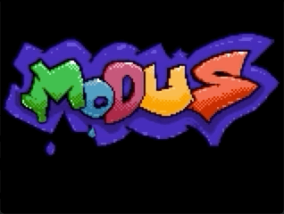

# Brickout 

Brickout is a cross-platform a block-breaking game developed by [Modus Create](https://moduscreate.com) to demonstrate how to use the creative engine library. Brickout runs on the [ODROID GO](https://www.hardkernel.com/shop/odroid-go/), macOS and Linux.

## How to Play
Smash the blocks with the ball by moving your paddle (`← →`), preventing it from going out of bounds.

## Getting started
To build Brickout, please follow the [Getting Started](./md/DEVELOPING.md#getting-started) in our [developer guide](./md/DEVELOPING.md).

## Keymap for computer-based players:

#### Global (all screens)
| Key(s) | Description |
| --- | --- |
| `Q` | Quits the game |

#### Main Menu
| Key(s) | Description |
| --- | --- |
| `4` `RETURN` `X` `Z` `SPACE` | Start the game |

### Instructions screens
| Key(s) | Description |
| --- | --- |
| `← →` | Navigate how to play screens |

### Game
| Key(s) | Description |
| --- | --- |
|`← →` | Moves the paddle |

## License
Brickout is licensed under [MIT](https://opensource.org/licenses/MIT).

# Contributing
Interested in contributing to Brickout? Please see our [developing](./DEVELOPING.md) and [contributions](./CONTRIBUTIONS.MD) guidelines. 
